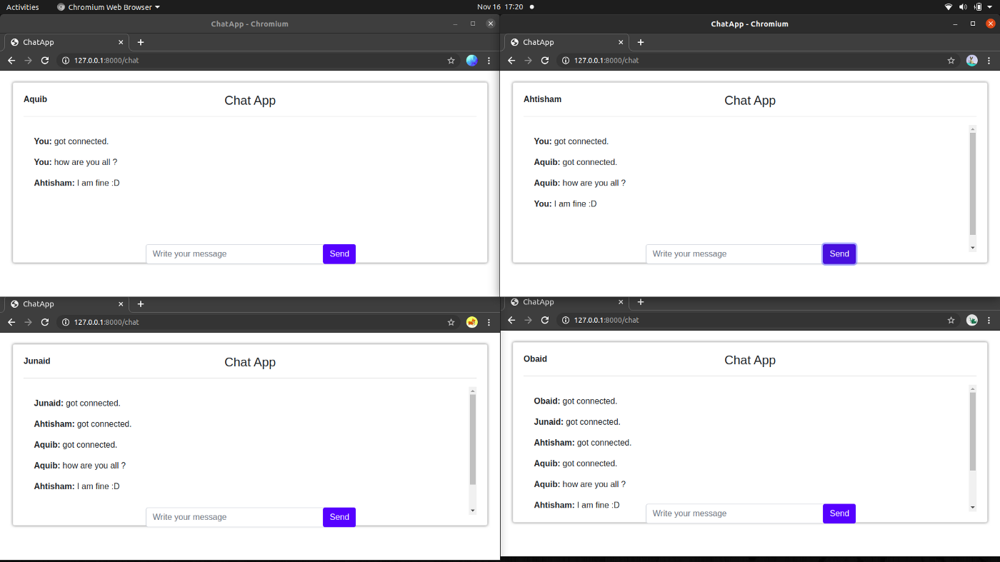

# fastapi-chat
 
A simple chat application using FastAPI which is a high performance framework that is mainly used to build API’s and web applications that demand speed.

The app  will have two pages:
- Home page:- Where users will have to register themselves by just entering their name.
- Chat page:- This is where users can start chatting with other connected users.

## Application:

